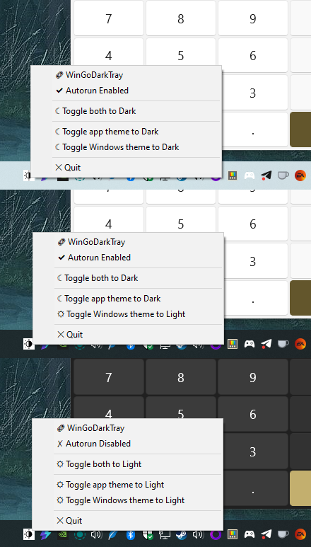

# WinGoDarkTray



**WinGoDarkTray** is a simple Go-based app that resides in your system tray and lets you toggle between light and dark themes for Windows, apps, and system-wide preferences with just a click.

## Features

- 🖥️ **System Tray**: Runs quietly in your system tray without distractions.
- 🌗 **Theme Toggle**: Toggle between light and dark modes for Windows UI, apps, and system-wide settings.
- ⚡ **Lightweight**: Fast, small, and easy to use with minimal resource consumption.
- 🚀 **Autorun**: Enable or disable autorun to have WinGoDarkTray launch with Windows startup.

## Requirements

- Windows 10 or newer.
- Go 1.24+ (only required if building from source).

## Installation

### Install via Winget

The easiest way to get started is by installing **WinGoDarkTray** via the [Windows Package Manager (winget)](https://learn.microsoft.com/en-us/windows/package-manager/winget/)

1. Open PowerShell.
2. (Optional) Run the following command to search for the latest version of WinGoDarkTray:

   ```powershell
   winget search WinGoDarkTray
   ```

3. Once you find the app, install it with the following command:

   ```powershell
   winget install 5mdt.WinGoDarkTray
   ```

4. After installation, open a new terminal or press `[Win] + [R]`, then type `WinGoDarkTray` and press Enter to start the app. **WinGoDarkTray** will appear in your system tray, ready for use.
5. (Optional) Press tray icon and enable autorun.

### Install from GitHub (Alternative Method)

If you prefer to install **WinGoDarkTray** directly from GitHub:

1. Visit the [Releases page](https://github.com/5mdt/WinGoDarkTray/releases).
2. Download the `.exe` file suitable for your architecture (x86 or x64).
3. Run the executable — it’ll pop up in your system tray, ready for use.
4. (Optional) Press tray icon and enable autorun.

### Building from Source

If you want to build **WinGoDarkTray** from source, follow these steps:

1. Make sure Go 1.24+ is installed. You can download Go from [here](https://golang.org/dl/).
2. Clone this repository:

   ```bash
   git clone https://github.com/5mdt/WinGoDarkTray.git
   cd WinGoDarkTray
   ```

3. Build the application:

   ```bash
   go build -o WinGoDarkTray.exe
   ```

4. Double-click `WinGoDarkTray.exe` to launch it, and it will appear in your system tray.

### Building from Source

To build WinGoDarkTray from source, follow these steps:

1. Make sure Go 1.24+ is installed. You can download Go from [here](https://golang.org/dl/).
2. Clone this repository:

   ```bash
   git clone https://github.com/5mdt/WinGoDarkTray.git
   cd WinGoDarkTray
   ```

3. Build the application:

   ```bash
   go build -o WinGoDarkTray.exe
   ```

4. Double-click `WinGoDarkTray.exe` to launch it, and it will appear in your system tray.
5. (Optional) Press tray icon and enable autorun.

## Contributing

We welcome contributions! If you'd like to contribute, follow these steps:

1. Fork the repository.
2. Create a new branch: `git checkout -b feature/your-feature`.
3. Make your changes and commit them: `git commit -am 'Add new feature'`.
4. Push to your branch: `git push origin feature/your-feature`.
5. Open a pull request on GitHub.

## License

This project is licensed under the GPL v3 License — see the [LICENSE](LICENSE) file for details.

## Acknowledgements

- Big thanks to the Go community for the awesome language!
- Special thanks to [Win32 API](https://learn.microsoft.com/en-us/windows/win32/api/) for making system tray integration possible.
- [anboris](https://github.com/anboris/) for the original idea and `godark` name.

## Authors

- [5mdt Team](https://github.com/5mdt)
